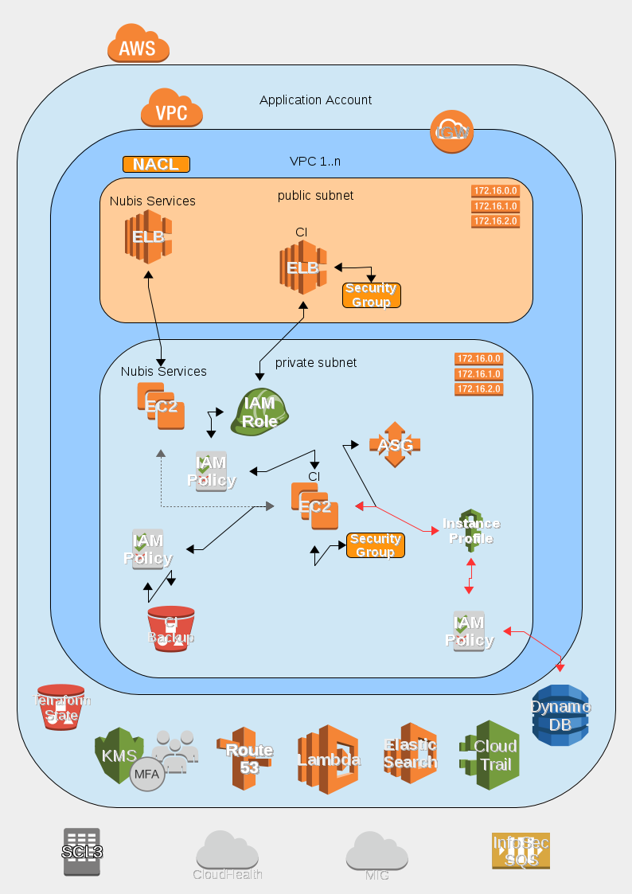

# nubis-ci 

## CI Deployment

The Nubis CI project is designed to be deployed into a standard Nubis Account.
It takes advantage of the standard deployment found [here](https://github.com/nubisproject/nubis-docs/blob/master/DEPLOYMENT_OVERVIEW.md).
For further specifics about CI consult the Jenkins documentation [here](https://jenkins.io/doc/).

The CI system is designed to run two basic jobs. The first job watches a single
GitHub repository and builds a new AMI when that repository changes. It then
runs the second job which deploys the AMI into the Stage environment. The second
job can be triggered manually to deploy the AMI into the Prod environment. All
deployments are applied using Terraform.

### Deployment Diagram

**NOTE**: The line colors are representative and are for readability only. They
are not intended to indicate any underlying protocol or specific communication
details.

### Deployment Notes

The CI deployment consists of:

- A single EC2 instance acting as a Jenkins server
- An Auto Scaling group to provide resiliency
- A S3 log bucket where backups and artifacts are stored
- An ELB to facilitate inbound connectivity

### Deployment Resources

Details for the deployment including; naming conventions, relationships,
permissions, etcetera, can be found in the [Terraform template](nubis/terraform/main.tf)
used for deployment. Links to specific resources can be found in the following
table.

|Resource Type|Resource Title|Code Location|
|-------------|--------------|-------------|
|atlas_artifact|nubis-ci|[nubis/terraform/main.tf#L1](nubis/terraform/main.tf#L1)|
|tls_private_key|ci|[nubis/terraform/main.tf#L19](nubis/terraform/main.tf#L19)|
|tls_self_signed_cert|ci|[nubis/terraform/main.tf#L26](nubis/terraform/main.tf#L26)|
|aws_iam_server_certificate|ci|[nubis/terraform/main.tf#L52](nubis/terraform/main.tf#L52)|
|aws_elb|ci|[nubis/terraform/main.tf#L68](nubis/terraform/main.tf#L68)|
|aws_security_group|elb|[nubis/terraform/main.tf#L102](nubis/terraform/main.tf#L102)|
|aws_security_group|ci|[nubis/terraform/main.tf#L130](nubis/terraform/main.tf#L130)|
|aws_autoscaling_group|ci|[nubis/terraform/main.tf#L169](nubis/terraform/main.tf#L169)|
|aws_launch_configuration|ci|[nubis/terraform/main.tf#L201](nubis/terraform/main.tf#L201)|
|aws_route53_record|ci|[nubis/terraform/main.tf#L236](nubis/terraform/main.tf#L236)|
|aws_s3_bucket|ci_artifacts|[nubis/terraform/main.tf#L245](nubis/terraform/main.tf#L245)|
|aws_iam_instance_profile|ci|[nubis/terraform/main.tf#L264](nubis/terraform/main.tf#L264)|
|aws_iam_role|ci|[nubis/terraform/main.tf#L272](nubis/terraform/main.tf#L272)|
|aws_iam_role_policy|ci_artifacts|[nubis/terraform/main.tf#L293](nubis/terraform/main.tf#L293)|
|aws_iam_role_policy|ci_build|[nubis/terraform/main.tf#L323](nubis/terraform/main.tf#L323)|
|aws_iam_role_policy|ci_deploy|[nubis/terraform/main.tf#L371](nubis/terraform/main.tf#L371)|
|null_resource|credstash|[nubis/terraform/main.tf#L488](nubis/terraform/main.tf#L488)|

## Quick start

1. `git clone git@github.com:nubisproject/nubis-base.git`
2. `git clone git@github.com:nubisproject/nubis-builder.git`
3. Refer to README.md in nubis-builder on how to build this project.

## Github Authentication

You need to create a new OAuth application by going to : <https://github.com/settings/applications/new>

Set the homepage to:
`https://ci.<application>.admin.us-east-1.<account>.nubis.allizom.org/`
Set the callback URL to:
`https://ci.<application>.admin.us-east-1.<account>.nubis.allizom.org/securityRealm/finishLogin`

And use the provided Client ID and Client Secret as inputs, respectively:
github_oauth_client_id and github_oauth_client_secret

## File structure

### `nubis`

All files related to the nubis ci project

### `nubis/bin`

Scripts related to configuring nubis-ci AMIs creation

### `nubis/nubis-puppet`

This is the puppet tree that's populated with librarian-puppet, it's in
.gitignore and gets reset on every build.

### `nubis/builder`

JSON files that describe the project, configure settings, configure
provisioners, etc.

### `nubis/terraform`

Terraform deployment templates.
